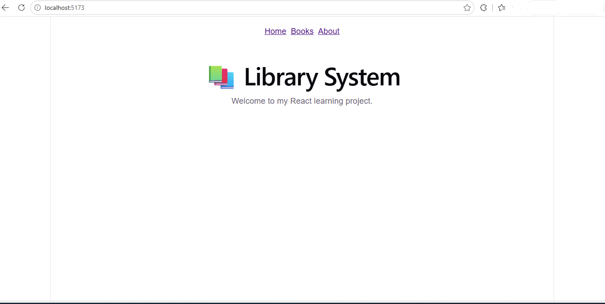
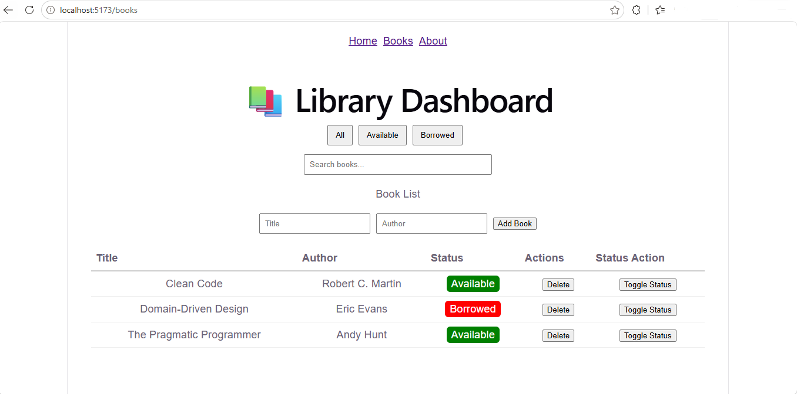
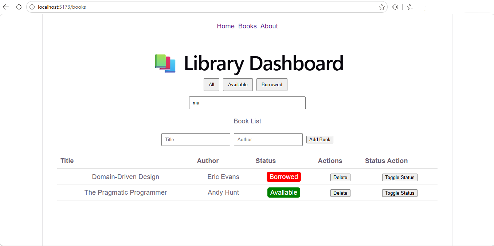
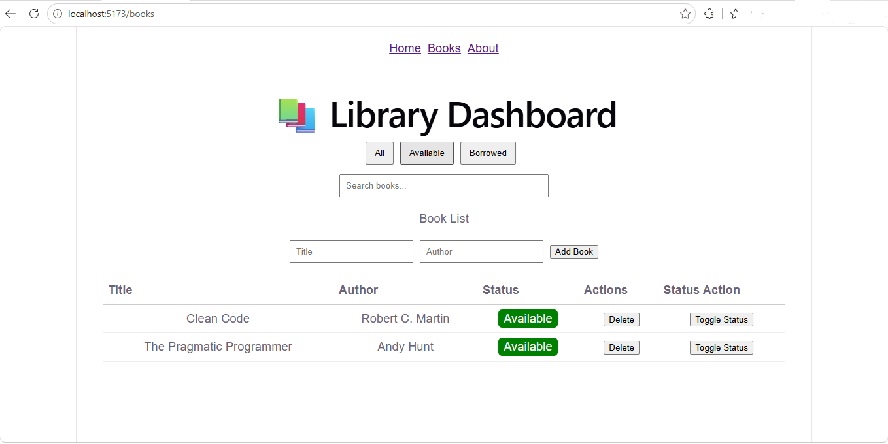
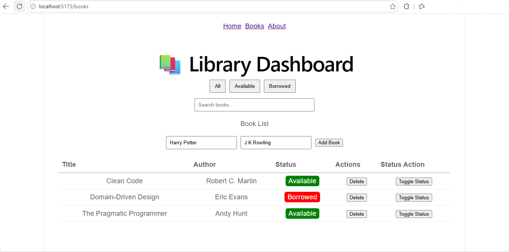
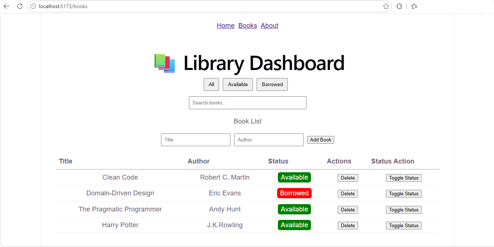
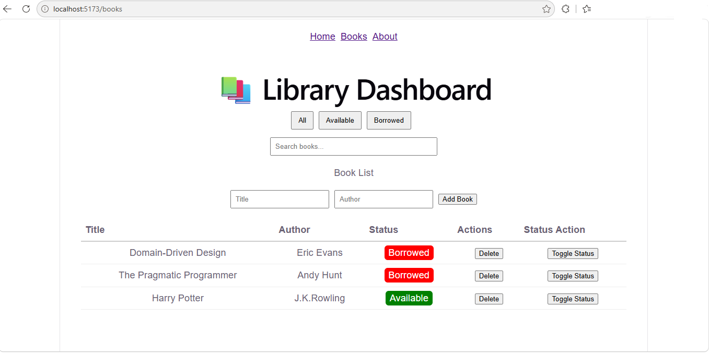
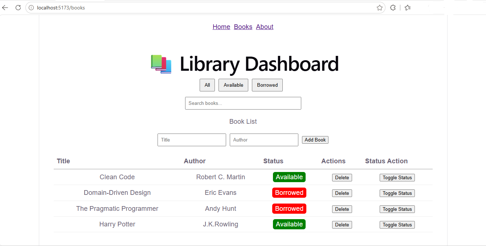

# 📚 Library Dashboard (React)

A React-based Library Dashboard application that demonstrates modern frontend development practices including component-based architecture, state management, and client-side routing.

This project was built as a portfolio piece to showcase practical React skills used in real-world business applications such as internal dashboards and management systems.

---

## 🚀 Key Features

- 📖 Display a list of books in a structured dashboard table
- ➕ Add new books dynamically
- ❌ Delete books from the system
- 🔁 Toggle book status (Available / Borrowed)
- 🔍 Real-time search filtering by book title
- 🏷️ Status-based filtering (All / Available / Borrowed)
- 🧭 Multi-page navigation using React Router (Home / Books / About)
- 🧩 Modular component design for maintainability and reuse

---

## 🛠️ Tech Stack

- React (Vite)
- React Router DOM
- JavaScript (ES6+)
- HTML5
- CSS3
- Node.js / npm

---

## 🧠 Core Concepts Demonstrated

This project demonstrates practical understanding of:

- React functional components
- Hooks (`useState`, `useEffect`)
- Controlled inputs and form handling
- State lifting and prop drilling
- Conditional rendering
- Array operations (`map`, `filter`)
- Component composition
- Client-side routing (SPA architecture)

---

## 📁 Project Structure

```text
src/
├── components/
│   ├── BookForm.jsx
│   ├── BookTable.jsx
│   ├── BookFilters.jsx
│
├── pages/
│   ├── Home.jsx
│   ├── About.jsx
│
├── App.jsx
├── main.jsx
```

---

## ▶️ Getting Started

### 1. Clone the repository
```bash
git clone https://github.com/KTChew/library-dashboard.git
cd library-dashboard
```


### 2. Install dependencies
```bash
npm install
```

### 3. Start development server
```bash
npm run dev
```

### 4. Open in browser
```bash
http://localhost:5173
```

## 📸 Screenshots

### Home Page


### Books Dashboard


### Search Functionality


### Filtering System


### Add / Delete Actions





